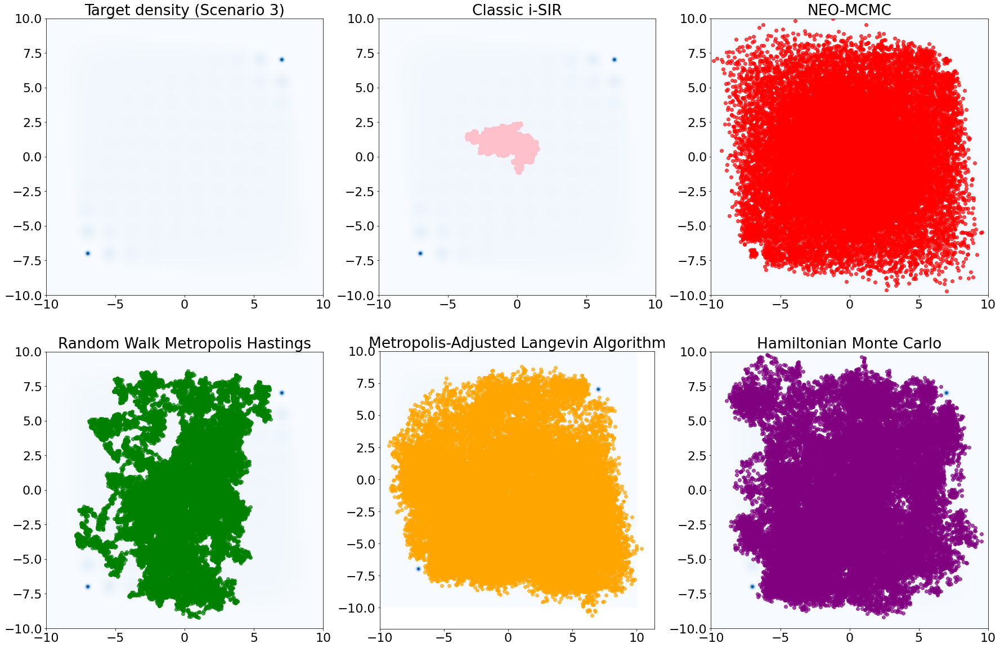

# NEO: Non Equilibrium Sampling on the orbit of a deterministic transform

## Introduction

This repository presents our implementation of the paper [*NEO: Non Equilibrium Sampling on the orbit of a deterministic transform*](https://arxiv.org/abs/2103.10943) published in NeurIPS 2021 and written by Achille Thin (CMAP), Yazid Janati (IP Paris, TIPIC-SAMOVAR, CITI), Sylvain Le Corff (IP Paris, TIPIC-SAMOVAR, CITI), Charles Ollion (CMAP), Arnaud Doucet, Alain Durmus (CMLA), Eric Moulines (CMAP) and Christian Robert (CEREMADE).

The code has been written with the library [JAX](https://deepmind.com/blog/article/using-jax-to-accelerate-our-research) (high-performance numerical computing framework developed by Google Brain and Deepmind) as well as [Tensorflow Probability](https://www.tensorflow.org/probability) a Google's library for probabilistic reasoning. JAX enables our code to be run in parallel on CPU, GPU or TPU without any efforts. It was based on the [Github repository](https://github.com/Achillethin/NEO_non_equilibrium_sampling) of Achille Thin which was opened right when needed it.

Our research topic for this project was the algorithms proposed in [Thin et al., 2021], which are extensions of the NEIS algorithm introduced in [Rotskoff and Vanden-Eijnden, 2019]. Here, we focus on a target distribution of the form  where  is a probability density function (pdf) on  and  is a nonnegative function. Typically, in a Bayesian setting,  is a posterior distribution associated with a prior distribution  and a likelihood function . The main contribution of the paper is to introduce two brand new algorithms, called NEO-IS and NEO-MCMC. The former returns an unbiased estimate of the intractable normalizing constant  of , and the latter, built upon NEO-IS, provides a sampling mechanism from that same distribution .



## Implementation

* Classes
  * `importance_sampler` implements NEO-IS as well as classic importance sampling
  * `isir` implements a very general Iterated Sampling Importance Resampling scheme (the IS classes implement a part of it) from an instance of `ClassicIS`
  * `transformation` implements generic bijections
  * `autotune_is` and `benchmark_sampler` are used to make graphs and vizualisations
* The [notebook](notebook/neo-notebook.ipynb) explains the theory behind the code and provides explicit illustrations on how to use the previously mentioned classes

## Citing the paper

If you use this repository, please reference the article (e.g. using bibtex)

```
@inproceedings{thin2021neo,
	title={NEO: Non Equilibrium Sampling on the Orbits of a Deterministic Transform},
	author={Thin, Achille and El Idrissi, Yazid Janati and Le Corff, Sylvain and Ollion, Charles and Moulines, Eric and Doucet, Arnaud and Durmus, Alain and Robert, Christian P},
	booktitle={Thirty-Fifth Conference on Neural Information Processing Systems},
	year={2021}
}
```

or other formats available at on [Google Scholar](https://scholar.google.com/scholar?hl=en&as_sdt=0%2C5&authuser=1&q=neo+non+equilibrium&btnG=&oq=neo+no#d=gs_cit&u=%2Fscholar%3Fq%3Dinfo%3AeV5WBKEHRfkJ%3Ascholar.google.com%2F%26output%3Dcite%26scirp%3D0%26hl%3Den%26authuser%3D1).
